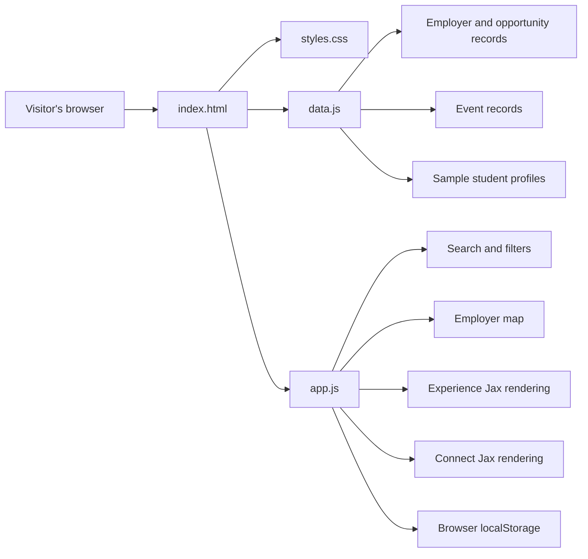
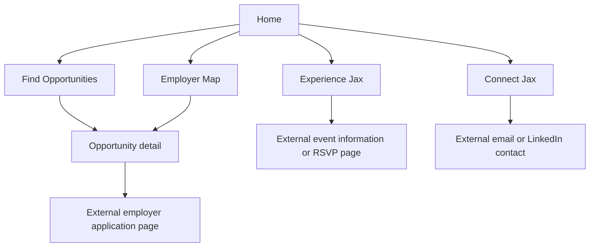

# Current-State Architecture

**Status:** `LIVE` prototype architecture  
**Last reviewed:** 2026-07-12

## Summary

WorkJax is currently a static, browser-based prototype. It does not use a frontend framework, application server, database, user authentication system, or shared content-management system.

## Current Technology

| File or Service | Responsibility |
|---|---|
| `index.html` | Page structure, navigation, forms, filters, and feature containers |
| `styles.css` | Visual design and responsive styling |
| `data.js` | Hard-coded employers, opportunities, events, sample student profiles, and map coordinates |
| `app.js` | Page switching, rendering, filtering, saving, RSVP behavior, profiles, and map behavior |
| Vercel | Static deployment and hosting |
| Leaflet / map tiles | Interactive employer map |
| Browser `localStorage` | Device-specific saved opportunities and prototype profile data |

## Current Application Flow

## Current Data Behavior

| Capability | Current Behavior | Status |
|---|---|---|
| Opportunity listings | Read from hard-coded objects in `data.js` | `LIVE` |
| Opportunity verification | No formal verification process | `TBD` |
| Expiration | Deadline text is displayed, but listings do not automatically deactivate | `PROPOSED` |
| Saved opportunities | Stored only in the visitor's browser | `DEMO ONLY` |
| Employer locations | Latitude and longitude are manually stored in `data.js` | `LIVE` |
| Event listings | Hard-coded in `data.js` | `LIVE` |
| Event expiration | Events do not automatically disappear based on a structured end date | `PROPOSED` |
| Student profiles | Sample records are hard-coded | `DEMO ONLY` |
| User-created profile | Stored only on the device that created it | `DEMO ONLY` |
| RSVP data | Held temporarily in browser memory | `DEMO ONLY` |
| Shared accounts | None | `TBD` |
| Database | None | `TBD` |
| Administrative dashboard | None | `TBD` |

## Important Current Limitations

### 1. Employer and opportunity are combined

The `employers` array currently treats an employer record as an opportunity record. Fields such as `type`, `grade`, `paid`, `deadline`, and `duration` belong to opportunities, but are stored directly on the employer.

This prevents one employer from cleanly supporting multiple opportunities with different:

- Deadlines
- Student eligibility
- Compensation
- Locations
- Durations
- Opportunity types
- Application links

The target model must separate `Employer` and `Opportunity`.

### 2. Profiles are not actually public or shared

A profile created through the prototype is saved to browser `localStorage`. It is visible only on the same device and browser. It is not uploaded to a shared directory.

### 3. RSVP behavior is temporary

RSVP information is stored in JavaScript memory and can reset when the page reloads. It is not connected to a user account or shared database.

### 4. Featured opportunities are positional

The homepage currently treats the first records in the employer dataset as featured. There is no formal featured flag, ranking rule, review date, or owner.

### 5. Dates are unstructured text

Opportunity deadlines and event dates are stored as descriptive text. Automatic expiration requires structured date fields such as `application_close_at`, `starts_at`, and `ends_at`.

## Current Product Areas

