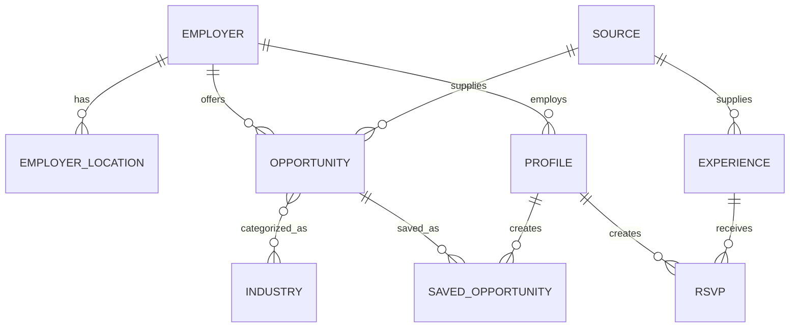

# Target Data Model

**Status:** `PROPOSED`

## Why the Data Model Must Change

The prototype combines employer and opportunity attributes in a single object. The operational product should separate reusable ecosystem entities so that one employer can have multiple opportunities, locations, and participating students.

## Entity Relationship Diagram

## Employer

| Field | Type | Notes |
|---|---|---|
| `id` | UUID | Stable internal identifier |
| `name` | text | Official employer name |
| `slug` | text | Public URL-safe identifier |
| `website_url` | URL | Official website |
| `careers_url` | URL | Official careers page |
| `description` | text | Employer overview |
| `logo_url` | URL | Approved logo source |
| `industries` | relationship | One or more industries |
| `status` | enum | active, inactive, pending_review |
| `last_verified_at` | timestamp | Content freshness |
| `created_at` | timestamp | Audit field |
| `updated_at` | timestamp | Audit field |

## Employer Location

| Field | Type | Notes |
|---|---|---|
| `id` | UUID | Stable identifier |
| `employer_id` | UUID | Parent employer |
| `label` | text | Example: Downtown Office |
| `address` | text | Validated street address |
| `latitude` | decimal | Generated by geocoding |
| `longitude` | decimal | Generated by geocoding |
| `is_opportunity_site` | boolean | Whether students may work here |
| `access_notes` | text | Transit, parking, entrance, etc. |
| `status` | enum | active, inactive |

## Opportunity

| Field | Type | Notes |
|---|---|---|
| `id` | UUID | Stable identifier |
| `employer_id` | UUID | Official employer |
| `external_id` | text | Source-system identifier |
| `title` | text | Opportunity title |
| `description` | text | Normalized description |
| `opportunity_types` | array/relationship | Internship, co-op, volunteer, etc. |
| `student_levels` | array/relationship | High school, college, both |
| `industries` | array/relationship | Multiple allowed |
| `seasonality` | array | Summer, semester, year-round |
| `work_mode` | enum | onsite, hybrid, remote |
| `location_id` | UUID/null | Required for onsite or hybrid roles |
| `compensation_type` | enum | paid, unpaid, credit, stipend, unknown |
| `compensation_text` | text | Optional source wording |
| `application_url` | URL | Official external application page |
| `application_open_at` | timestamp/null | Structured date |
| `application_close_at` | timestamp/null | Structured date |
| `starts_at` | timestamp/null | Program start |
| `ends_at` | timestamp/null | Program end |
| `is_featured` | boolean | Explicit feature flag |
| `featured_until` | timestamp/null | Prevents indefinite featuring |
| `source_id` | UUID | Record provenance |
| `source_last_seen_at` | timestamp | Last successful source match |
| `last_verified_at` | timestamp | Freshness |
| `status` | enum | draft, active, expired, closed, review_required |
| `confidence_score` | decimal | Optional ingestion confidence |

## Experience

Use one shared entity with a clear subtype.

| Field | Type | Notes |
|---|---|---|
| `id` | UUID | Stable identifier |
| `title` | text | Event or recurring experience name |
| `experience_type` | enum | scheduled_event, recurring_space |
| `description` | text | Public description |
| `categories` | array/relationship | Arts, sports, outdoors, etc. |
| `starts_at` | timestamp/null | Scheduled events |
| `ends_at` | timestamp/null | Scheduled events |
| `recurrence_rule` | text/null | Recurring experiences |
| `location_name` | text | Venue |
| `address` | text | Location |
| `latitude` | decimal/null | Map support |
| `longitude` | decimal/null | Map support |
| `price_text` | text | Example: Free or From $10 |
| `is_free` | boolean | Filter |
| `transportation_notes` | text | Required product field |
| `accessibility_notes` | text | Required product field |
| `age_restrictions` | text | Required product field |
| `external_url` | URL | Official source or RSVP page |
| `source_id` | UUID | Provenance |
| `last_verified_at` | timestamp | Freshness |
| `status` | enum | active, expired, cancelled, review_required |

## Profile

| Field | Type | Notes |
|---|---|---|
| `id` | UUID | Shared profile identifier |
| `user_id` | UUID | Authenticated account owner |
| `display_name` | text | Public name |
| `email` | text | Private account/contact field by default |
| `student_level` | enum | high_school, college, other |
| `school` | text | Optional or verified |
| `employer_id` | UUID/null | Current placement |
| `major_or_grade` | text | Optional |
| `interests` | array | Searchable interests |
| `linkedin_url` | URL/null | Optional public contact link |
| `other_contact_url` | URL/null | Approved external contact |
| `visibility` | enum | private, network_only, public |
| `is_minor` | boolean | Drives safety rules |
| `guardian_consent_at` | timestamp/null | Required if policy allows minor profiles |
| `moderation_status` | enum | pending, approved, flagged, suspended |
| `created_at` | timestamp | Audit field |
| `updated_at` | timestamp | Audit field |
| `deleted_at` | timestamp/null | Supports deletion workflow |

## Source Registry

| Field | Type | Notes |
|---|---|---|
| `id` | UUID | Stable identifier |
| `entity_type` | enum | opportunity or experience |
| `organization_name` | text | Source owner |
| `source_url` | URL | Feed or page |
| `source_type` | enum | ATS API, JSON feed, RSS, structured page, manual |
| `sync_frequency` | enum | daily, weekly, manual |
| `last_sync_at` | timestamp | Health |
| `last_success_at` | timestamp | Health |
| `last_error` | text/null | Troubleshooting |
| `active` | boolean | Controls ingestion |

## Supporting Entities

- `Industry`
- `SavedOpportunity`
- `RSVP`
- `Report`
- `ModerationAction`
- `AuditLog`
- `SourceSyncRun`
- `AdminUser`
