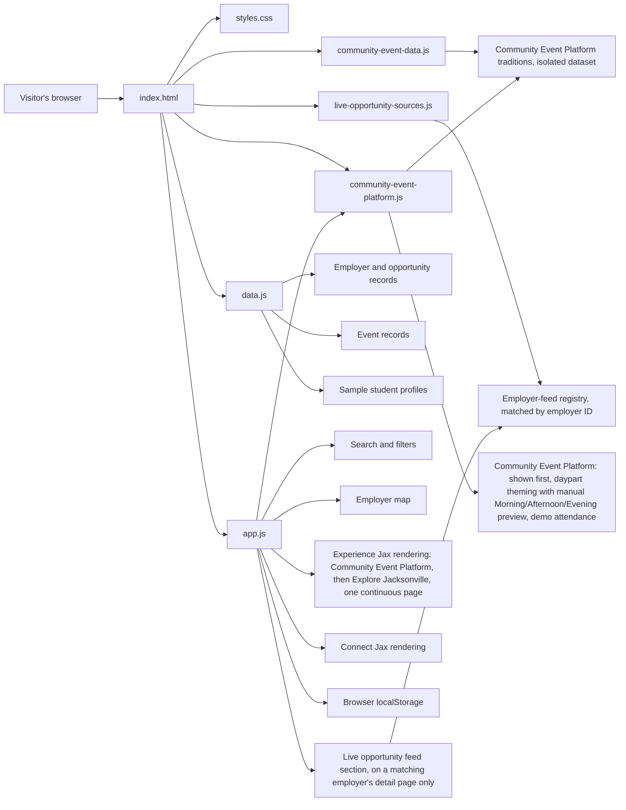
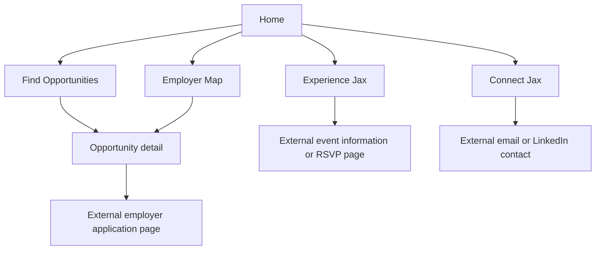

# Current-State Architecture

**Status:** `LIVE` prototype architecture  
**Last reviewed:** 2026-07-14

## Summary

WorkJax is currently a static, browser-based prototype. It does not use a frontend framework, application server, database, user authentication system, or shared content-management system. Two narrow exceptions exist: `api/dnb-lever-jobs.js` and `api/miller-internship-program.js`, both Vercel Functions described below, are now called from the browser — but only from their own respective employer detail pages (Dun & Bradstreet and Miller Electric Company), and do not change this overall picture.

## Current Technology

| File or Service | Responsibility |
|---|---|
| `index.html` | Page structure, navigation, forms, filters, and feature containers |
| `styles.css` | Visual design and responsive styling |
| `data.js` | Hard-coded employers, opportunities, events, sample student profiles, and map coordinates |
| `live-opportunity-sources.js` | Browser-visible, frozen registry (`window.LIVE_OPPORTUNITY_SOURCES`) mapping a stable employer ID to a live-opportunity-feed endpoint, provider, and display label. Loaded after `data.js` and before `app.js`. Currently contains two enabled entries, for Dun & Bradstreet and Miller Electric Company. See `docs/integrations/employer-feed-registry.md`. |
| `app.js` | Page switching, rendering, filtering, saving, RSVP behavior, profiles, map behavior, and the generic `liveOpportunity*` functions that read the registry and render a live-feed section (including the generic `postingKind: "official_program"` card) on a matching employer's detail page |
| `community-event-data.js` | Frozen, browser-visible dataset (`window.COMMUNITY_EVENT_PLATFORM_DATA`) for the Community Event Platform prototype nested subtab on the Third Spaces page. Adapted from the public `espil77/3rd-Space` repository. Entirely separate from the `events`/`employers` data above — never merged. See `docs/features/community-event-platform.md`. |
| `community-event-platform.js` | Isolated module exposing `window.CommunityEventPlatform` (`initialize` only). Renders the Community Event Platform section — now the first content shown on the Third Spaces page, with Explore Jacksonville directly beneath it on the same continuous page (nested tabs removed 2026-07-14) — drives its client-clock daypart theming plus an accessible manual Morning/Afternoon/Evening theme-preview control and "Use my current time" reset (scoped to `#cep-shell` only), and its device-local, demo-only "I'll Be There" interaction. Does not call or duplicate `renderEvents()`. |
| Vercel | Static deployment and hosting |
| Leaflet / map tiles | Interactive employer map |
| Browser `localStorage` | Device-specific saved opportunities and prototype profile data |
| `api/dnb-lever-jobs.js` | Vercel Function. Fetches Dun & Bradstreet's public Lever postings board, filters to Jacksonville student/early-talent postings, and returns normalized JSON. Called from `app.js` only when the existing Dun & Bradstreet employer detail page is opened, via the employer-feed registry. See `docs/integrations/dnb-lever-poc.md` and `docs/integrations/employer-feed-registry.md`. |
| `api/miller-internship-program.js` | Vercel Function. Fetches Miller Electric Company's own official internship-program webpage (`mecojax.com`, not a structured jobs API), conservatively parses application status and internship areas, and returns one normalized program-level record as JSON. Called from `app.js` only when the existing Miller Electric Company employer detail page is opened, via the employer-feed registry. Independent of the separate weekly iCIMS public-portal monitor. See `docs/integrations/miller-internship-program.md` and `docs/integrations/employer-feed-registry.md`. |

## Current Application Flow

## Current Data Behavior

| Capability | Current Behavior | Status |
|---|---|---|
| Opportunity listings | Read from hard-coded objects in `data.js` | `LIVE` |
| Opportunity verification | No formal verification process | `TBD` |
| Expiration | Deadline text is displayed, but listings do not automatically deactivate | `PROPOSED` |
| Saved opportunities | Stored only in the visitor's browser | `DEMO ONLY` |
| Employer locations | Latitude and longitude are manually stored in `data.js` | `LIVE` |
| Event listings | Hard-coded in `data.js` | `LIVE` |
| Event expiration | Events do not automatically disappear based on a structured end date | `PROPOSED` |
| Student profiles | Sample records are hard-coded | `DEMO ONLY` |
| User-created profile | Stored only on the device that created it | `DEMO ONLY` |
| RSVP data | Held temporarily in browser memory | `DEMO ONLY` |
| In-UI prototype disclosures | The Opportunities board, the Community Hub profile form, and each event's RSVP control now display a visible "Prototype note" explaining that saves are device-only, profiles are device-only and not shared, and RSVPs are demonstration-only | `LIVE` |
| Shared accounts | None | `TBD` |
| Database | None | `TBD` |
| Administrative dashboard | None | `TBD` |
| Employer live-opportunity feed registry | `live-opportunity-sources.js` defines a frozen, browser-visible list of employers eligible for a live opportunity feed, matched by stable employer ID. `app.js` only fetches and renders a live feed for an employer with a matching, `enabled: true` registry entry, and only when that employer's existing detail page is opened. Currently two entries are enabled, for Dun & Bradstreet and Miller Electric Company — see `docs/integrations/employer-feed-registry.md` | `LIVE` (registry mechanism; two enabled entries) |
| Dun & Bradstreet Lever job feed | `api/dnb-lever-jobs.js` returns normalized, Jacksonville-filtered student/early-talent postings from Dun & Bradstreet's public Lever board. Called only from the existing Dun & Bradstreet detail page (`app.js`, `renderLiveOpportunitySection()`, via the employer-feed registry), cached in memory for the browser page session. Not merged into `data.js`, not a citywide job aggregator, and no other employer's page calls it — see `docs/integrations/dnb-lever-poc.md` | `LIVE` (scoped to one employer's detail page) |
| Miller Electric official internship-program page | `api/miller-internship-program.js` returns one normalized program-level record — application status (`open`/`closed`/`unknown` with supporting evidence), internship areas, paid/eligibility signals only when explicitly stated, and approved official links — read directly from Miller's own internship-program webpage (`mecojax.com`), never from an iCIMS job feed and never individual job requisitions. Called only from the existing Miller Electric Company detail page (`app.js`, `renderLiveOpportunitySection()`, via the employer-feed registry), cached in memory for the browser page session. Independent of the separate weekly iCIMS public-portal monitor — see `docs/integrations/miller-internship-program.md` | `LIVE` (scoped to one employer's detail page) |
| Community Event Platform prototype | The first section shown on the Third Spaces page (nested tabs removed 2026-07-14 — Explore Jacksonville now renders directly beneath it on the same continuous page), adapted from the public `espil77/3rd-Space` repository. Its own frozen dataset (`community-event-data.js`), own render/daypart module (`community-event-platform.js`), an accessible manual Morning/Afternoon/Evening theme-preview control (session-only override, not stored in `localStorage`), and a device-local, demo-only "I'll Be There" interaction stored under a WorkJax-prefixed `localStorage` key. All seven schedule records are `verificationStatus: "unverified"`. Never merged into `events`/`employers`. See `docs/features/community-event-platform.md` | `DEMO ONLY` |

## Important Current Limitations

### 1. Employer and opportunity are combined

The `employers` array currently treats an employer record as an opportunity record. Fields such as `type`, `grade`, `paid`, `deadline`, and `duration` belong to opportunities, but are stored directly on the employer.

This prevents one employer from cleanly supporting multiple opportunities with different:

- Deadlines
- Student eligibility
- Compensation
- Locations
- Durations
- Opportunity types
- Application links

The target model must separate `Employer` and `Opportunity`.

### 2. Profiles are not actually public or shared

A profile created through the prototype is saved to browser `localStorage`. It is visible only on the same device and browser. It is not uploaded to a shared directory.

### 3. RSVP behavior is temporary

RSVP information is stored in JavaScript memory and can reset when the page reloads. It is not connected to a user account or shared database.

### 4. Featured opportunities have no selection rule, review date, or owner

The homepage and the opportunities-page "Featured" sort now use an explicit `isFeatured` boolean stored on each `employers` record in `data.js` (`LIVE`), rather than treating the first records in array order as featured. However, there is still no formal ranking rule, review date, or owner governing which records are marked `isFeatured: true` — that selection remains a manual edit to `data.js`.

### 5. Dates are unstructured text

Opportunity deadlines and event dates are stored as descriptive text. Automatic expiration requires structured date fields such as `application_close_at`, `starts_at`, and `ends_at`.

**Update (`LIVE`):** `data.js` now carries a structured-date foundation alongside the original text fields, per `docs/data/date-normalization-audit.md`:

- Every `employers` record has `applicationTiming` (the audit's classification: `annual_recurring`, `fixed_dated`, `seasonal_window`, `rolling`, or `unknown`), `applicationOpenAt`, `applicationCloseAt`, and `dateVerificationStatus`.
- Every `events` record has `experienceType` (`scheduled_event`, `recurring_space`, or `null` where the audit flags a needed split or an evergreen activity that doesn't fit the current enum), `startsAt`, `endsAt`, `recurrenceRule`, and `dateVerificationStatus`.
- On every current record, `applicationOpenAt`/`applicationCloseAt`/`startsAt`/`endsAt`/`recurrenceRule` are `null` and `dateVerificationStatus` is `"unverified"` — no year, date, or time was invented, and no record is being automatically removed.
- `app.js` now has `isOpportunityActive(record)` and `isEventActive(record)` helper functions, used when rendering homepage featured opportunities, opportunity search results, and Experience Jax events. Because every record is unverified, both helpers currently return `true` for everything, so visible counts and behavior are unchanged.
- The original `deadline`/`duration` (employers) and `date` (events) text fields remain the display source of truth; `deadlineSortKey()`'s existing text-based deadline sort is unchanged.

## Current Accessibility State

WorkJax contains some accessibility-conscious implementation patterns. Examples include native-button keyboard support and non-color selected-state indication in the Community Event Platform's theme-preview controls, and visible focus styles and some ARIA attributes elsewhere in `index.html` and `styles.css` (see `docs/features/community-event-platform.md`, §6, §8, and §13).

These examples have **not** been evaluated as part of a complete, documented WCAG 2.2 Level AA assessment. Their presence does not establish site-wide conformance.

The complete site accessibility status is **`NOT ASSESSED`**. No formal WorkJax operator or accessibility owner is currently assigned (see `docs/README.md` and `docs/operations/accessibility.md`). Current repository maintenance must not be interpreted as formal legal or organizational ownership of accessibility outcomes.

**2026-07-14 update:** The Third Spaces page was restructured from a nested-tab interface into one continuous page (Community Event Platform first, Explore Jacksonville directly beneath it), with a new accessible theme-preview control added. This is a material interface change. It is not described as accessibility verified or WCAG conformant, and the paused baseline accessibility audit (`docs/accessibility/baseline-audit-2026-07-14.md`) was intentionally **not** modified or completed as part of this change — some of its findings (BASE-016/BASE-017, describing the now-removed `role="tablist"`/`role="tab"` markup) no longer describe the current page and will need to be revisited in a future accessibility-focused pass. Keyboard, focus, contrast (across all three themes), zoom, reflow, screen-reader, and mobile touch-target testing of the revised page remain required before any accessibility-verified claim can be made.

See `docs/operations/accessibility.md`, `docs/accessibility/wcag-2.2-aa-checklist.md`, and `docs/accessibility/accessibility-audit-log.md` for the proposed accessibility standard and governance framework. No accessibility audit has been performed as part of this documentation update.

## Current Product Areas

