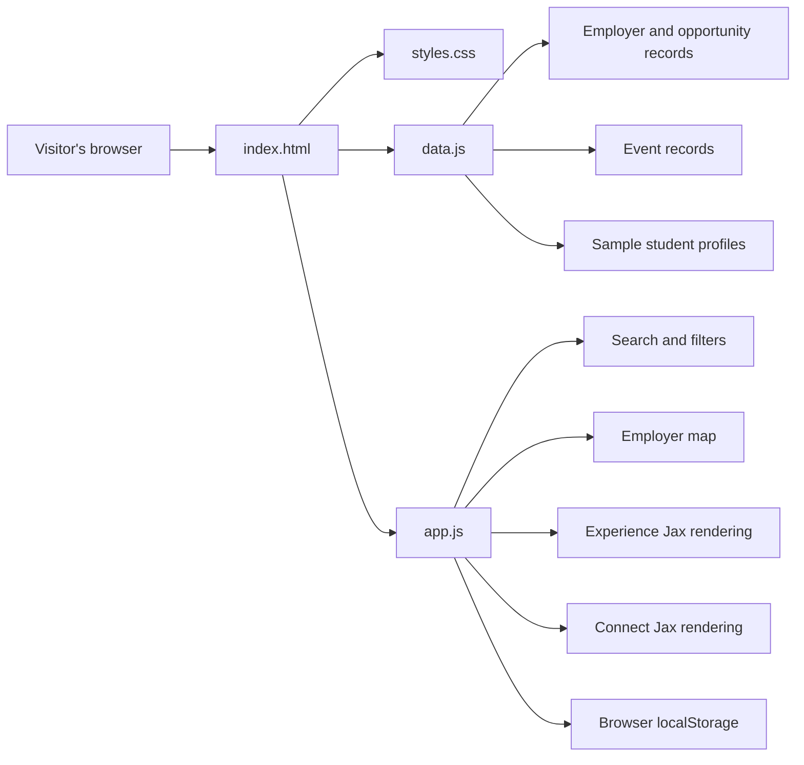
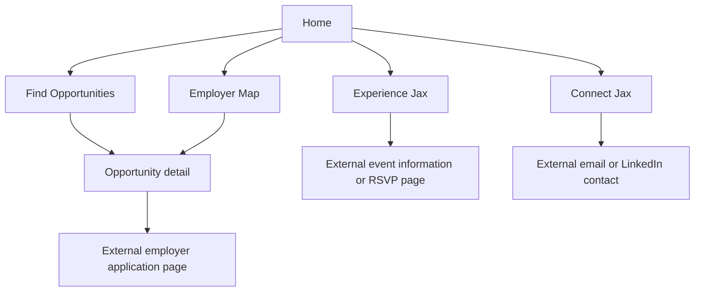

# Current-State Architecture

**Status:** `LIVE` prototype architecture  
**Last reviewed:** 2026-07-13

## Summary

WorkJax is currently a static, browser-based prototype. It does not use a frontend framework, application server, database, user authentication system, or shared content-management system. One `DEMO ONLY` exception exists: `api/dnb-lever-jobs.js`, a single endpoint-only Vercel Function proof of concept described below, which is not linked from the UI and does not change this overall picture.

## Current Technology

| File or Service | Responsibility |
|---|---|
| `index.html` | Page structure, navigation, forms, filters, and feature containers |
| `styles.css` | Visual design and responsive styling |
| `data.js` | Hard-coded employers, opportunities, events, sample student profiles, and map coordinates |
| `app.js` | Page switching, rendering, filtering, saving, RSVP behavior, profiles, and map behavior |
| Vercel | Static deployment and hosting |
| Leaflet / map tiles | Interactive employer map |
| Browser `localStorage` | Device-specific saved opportunities and prototype profile data |
| `api/dnb-lever-jobs.js` | `DEMO ONLY` endpoint-only Vercel Function proof of concept. Fetches Dun & Bradstreet's public Lever postings board, filters to Jacksonville student/early-talent postings, and returns normalized JSON. Not called from `index.html` or `app.js`. See `docs/integrations/dnb-lever-poc.md`. |

## Current Application Flow

## Current Data Behavior

| Capability | Current Behavior | Status |
|---|---|---|
| Opportunity listings | Read from hard-coded objects in `data.js` | `LIVE` |
| Opportunity verification | No formal verification process | `TBD` |
| Expiration | Deadline text is displayed, but listings do not automatically deactivate | `PROPOSED` |
| Saved opportunities | Stored only in the visitor's browser | `DEMO ONLY` |
| Employer locations | Latitude and longitude are manually stored in `data.js` | `LIVE` |
| Event listings | Hard-coded in `data.js` | `LIVE` |
| Event expiration | Events do not automatically disappear based on a structured end date | `PROPOSED` |
| Student profiles | Sample records are hard-coded | `DEMO ONLY` |
| User-created profile | Stored only on the device that created it | `DEMO ONLY` |
| RSVP data | Held temporarily in browser memory | `DEMO ONLY` |
| In-UI prototype disclosures | The Opportunities board, the Community Hub profile form, and each event's RSVP control now display a visible "Prototype note" explaining that saves are device-only, profiles are device-only and not shared, and RSVPs are demonstration-only | `LIVE` |
| Shared accounts | None | `TBD` |
| Database | None | `TBD` |
| Administrative dashboard | None | `TBD` |
| Dun & Bradstreet Lever job feed | `api/dnb-lever-jobs.js` returns normalized, Jacksonville-filtered student/early-talent postings from Dun & Bradstreet's public Lever board. Not linked from any page, not merged into `data.js`, and not a citywide job aggregator — see `docs/integrations/dnb-lever-poc.md` | `DEMO ONLY` |

## Important Current Limitations

### 1. Employer and opportunity are combined

The `employers` array currently treats an employer record as an opportunity record. Fields such as `type`, `grade`, `paid`, `deadline`, and `duration` belong to opportunities, but are stored directly on the employer.

This prevents one employer from cleanly supporting multiple opportunities with different:

- Deadlines
- Student eligibility
- Compensation
- Locations
- Durations
- Opportunity types
- Application links

The target model must separate `Employer` and `Opportunity`.

### 2. Profiles are not actually public or shared

A profile created through the prototype is saved to browser `localStorage`. It is visible only on the same device and browser. It is not uploaded to a shared directory.

### 3. RSVP behavior is temporary

RSVP information is stored in JavaScript memory and can reset when the page reloads. It is not connected to a user account or shared database.

### 4. Featured opportunities have no selection rule, review date, or owner

The homepage and the opportunities-page "Featured" sort now use an explicit `isFeatured` boolean stored on each `employers` record in `data.js` (`LIVE`), rather than treating the first records in array order as featured. However, there is still no formal ranking rule, review date, or owner governing which records are marked `isFeatured: true` — that selection remains a manual edit to `data.js`.

### 5. Dates are unstructured text

Opportunity deadlines and event dates are stored as descriptive text. Automatic expiration requires structured date fields such as `application_close_at`, `starts_at`, and `ends_at`.

**Update (`LIVE`):** `data.js` now carries a structured-date foundation alongside the original text fields, per `docs/data/date-normalization-audit.md`:

- Every `employers` record has `applicationTiming` (the audit's classification: `annual_recurring`, `fixed_dated`, `seasonal_window`, `rolling`, or `unknown`), `applicationOpenAt`, `applicationCloseAt`, and `dateVerificationStatus`.
- Every `events` record has `experienceType` (`scheduled_event`, `recurring_space`, or `null` where the audit flags a needed split or an evergreen activity that doesn't fit the current enum), `startsAt`, `endsAt`, `recurrenceRule`, and `dateVerificationStatus`.
- On every current record, `applicationOpenAt`/`applicationCloseAt`/`startsAt`/`endsAt`/`recurrenceRule` are `null` and `dateVerificationStatus` is `"unverified"` — no year, date, or time was invented, and no record is being automatically removed.
- `app.js` now has `isOpportunityActive(record)` and `isEventActive(record)` helper functions, used when rendering homepage featured opportunities, opportunity search results, and Experience Jax events. Because every record is unverified, both helpers currently return `true` for everything, so visible counts and behavior are unchanged.
- The original `deadline`/`duration` (employers) and `date` (events) text fields remain the display source of truth; `deadlineSortKey()`'s existing text-based deadline sort is unchanged.

## Current Product Areas

