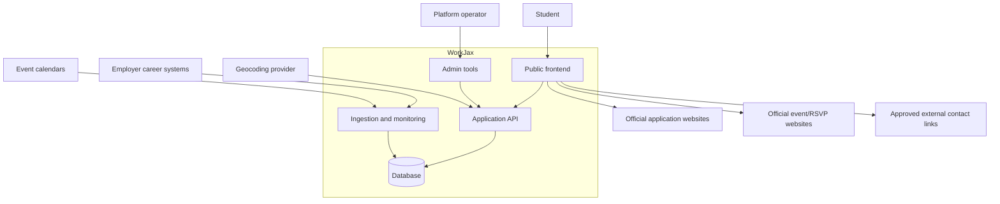

# System Context

**Status:** `PROPOSED`

## Primary Users

| User | Primary Need |
|---|---|
| High school student | Find safe, eligible experiential-learning opportunities |
| College student | Discover and compare internships, fellowships, co-ops, volunteering, and apprenticeships |
| Summer intern | Discover events, recurring community spaces, and peers |
| Employer | Reach talent without duplicating opportunity-entry work |
| Ecosystem partner | Operate, curate, and evaluate the platform |
| Content administrator | Review sources, resolve errors, and moderate content |
| Technical administrator | Maintain integrations, security, deployment, and data quality |

## External Systems

| System | Relationship to WorkJax |
|---|---|
| Employer career pages | Official source and application destination |
| Applicant tracking systems | Potential structured job-feed source |
| Event organizers and city calendars | Event source and RSVP destination |
| Geocoding provider | Converts validated addresses to coordinates |
| Email provider | Verification, account recovery, and administrative notifications |
| LinkedIn and external profiles | Optional outbound user contact method |
| Analytics provider | Measures product usage and outcomes |

## System Boundary

## Out of Scope

Unless intentionally added later, WorkJax does not:

- Process job or internship applications
- Replace employer applicant tracking systems
- Provide direct user-to-user messaging
- Create every event listed in Experience Jax
- Guarantee placement or employment
- Operate without a responsible ecosystem partner
