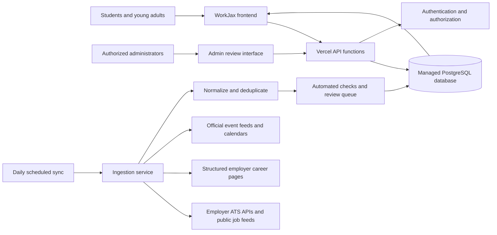

# Target-State Architecture

**Status:** `PROPOSED`

## Goal

Create an operational platform that can update opportunities and experiences with minimal duplicate work for employers while maintaining reliable data, clear ownership, and safe user profiles.

“Self-updating” should mean that WorkJax automates routine ingestion, expiration, and monitoring. It should not mean that the system operates without any accountable human owner.

## Proposed Architecture

## Proposed Components

| Component | Purpose |
|---|---|
| Static or lightweight frontend | Preserve the current accessible user experience |
| Vercel API functions | Secure database writes, profile actions, ingestion endpoints, and administrative actions |
| Managed PostgreSQL database | Shared source of truth for employers, opportunities, events, profiles, saves, and RSVPs |
| Authentication | Allow users to own, edit, and delete their profiles and saved items |
| Row-level authorization | Ensure users can edit only their own records and administrators can moderate |
| Daily scheduled ingestion | Check approved sources for new, changed, closed, and expired content |
| Source registry | Define where every employer and event record comes from. A first, narrow version of this idea exists today (`LIVE`) as `live-opportunity-sources.js` — a browser-visible registry matching one employer (Dun & Bradstreet) to its live Lever feed endpoint by stable employer ID. The target-state Source Registry described in `docs/data/data-model.md` is a full database table covering every employer and event source, with sync health fields (`last_sync_at`, `last_error`, etc.) that the current frontend-only registry does not have. |
| Review queue | Surface ambiguous, conflicting, or low-confidence records for human review |
| Audit log | Record when and why records changed |
| Analytics | Measure searches, application clicks, saves, RSVPs, and content freshness |

## Architecture Principles

1. **External applications remain external.** WorkJax directs users to official employer application pages.
2. **Do not require employers to re-enter existing listings.** Prefer public job feeds, applicant-tracking-system feeds, structured pages, or approved partner exports.
3. **Every public record has a source.**
4. **Every automated record has a last-checked timestamp.**
5. **Automation must fail safely.** A failed sync should not publish inaccurate information.
6. **Personal information is minimized.**
7. **Minors receive stronger protections than adult users.**
8. **AI assists moderation but does not replace accountable human review.**
9. **Current and target behavior remain explicitly separated in documentation.**
10. **The platform must have a named operator before public launch.**

## Community Event Platform: Current Prototype vs. Proposed Future

`docs/features/community-event-platform.md` documents a `DEMO ONLY` nested subtab adapted from a separate public project. To keep documentation and code from contradicting each other as this evolves:

- **`LIVE` today:** the nested-tab shell on the Third Spaces page, and the prototype's isolated, unverified schedule data and device-local demo attendance.
- **`PROPOSED`, not built:** an opt-in SMS text-message loop (a possible future "tell me what's happening tonight" concept). No phone number, SMS provider, or backend exists for this today, and none should be implied by any future copy changes without an explicit product/legal decision.
- **`TBD`:** whether this prototype's content is ever merged into WorkJax's own event data model, who owns verifying its schedule, and what privacy/moderation review would be required before any shared (non-device-local) version of attendance data is introduced. Per this document's Architecture Principles above (minimized personal information, stronger minor protections, named operator before public launch), any future version of this feature must clear the same bar as the rest of the target-state platform — it does not get a lighter review path just because it started as an adapted prototype.

## Accessibility Target State

For WorkJax to operate as a sustainable public platform, the target state includes:

1. A formally designated WorkJax operator.
2. A formally assigned accessibility owner, accepted in writing by that operator.
3. WCAG 2.2 Level AA as the design and engineering baseline for all features.
4. Documented accessibility evaluations against a defined scope, using the structure in `docs/accessibility/wcag-2.2-aa-checklist.md`.
5. Accessibility testing before major releases.
6. Accessibility re-testing after significant content or design changes.
7. A public accessibility-feedback channel.
8. A defined response and remediation process, tracked in `docs/accessibility/accessibility-audit-log.md`.
9. Recurring (not one-time) accessibility evaluations.
10. Inclusion of people with disabilities in testing when feasible.
11. Review of third-party services and outbound links (employer application pages, event pages, maps, embeds) for accessibility barriers.
12. Accessibility requirements in procurement standards for future vendors.
13. Legal-applicability review (ADA Title II/III, Section 504, Section 508, contractual/procurement requirements) performed by the formal operator or qualified counsel — not asserted in this documentation.
14. A public accessibility statement based on an actual completed assessment, replacing the internal `docs/accessibility/accessibility-statement-draft.md` template only once the prerequisites above are met.

None of the above exists today. See `docs/operations/accessibility.md` for the proposed policy and `docs/README.md` for current ownership status (`UNASSIGNED` for operator, accessibility owner, and remediation owner).

## Suggested Technical Direction

A practical path is to retain Vercel hosting and add:

- Vercel API functions for server-side logic
- Vercel scheduled jobs for daily synchronization
- A managed PostgreSQL service with authentication and row-level access controls
- A small administrative review interface

The exact vendor remains a decision for the eventual operator.
