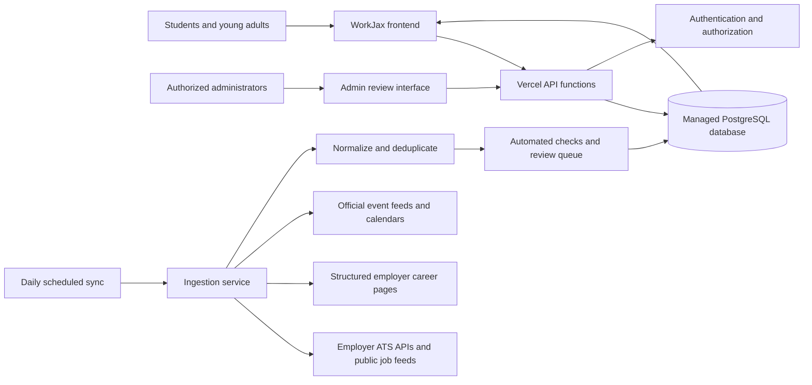

# Target-State Architecture

**Status:** `PROPOSED`

## Goal

Create an operational platform that can update opportunities and experiences with minimal duplicate work for employers while maintaining reliable data, clear ownership, and safe user profiles.

“Self-updating” should mean that WorkJax automates routine ingestion, expiration, and monitoring. It should not mean that the system operates without any accountable human owner.

## Proposed Architecture

## Proposed Components

| Component | Purpose |
|---|---|
| Static or lightweight frontend | Preserve the current accessible user experience |
| Vercel API functions | Secure database writes, profile actions, ingestion endpoints, and administrative actions |
| Managed PostgreSQL database | Shared source of truth for employers, opportunities, events, profiles, saves, and RSVPs |
| Authentication | Allow users to own, edit, and delete their profiles and saved items |
| Row-level authorization | Ensure users can edit only their own records and administrators can moderate |
| Daily scheduled ingestion | Check approved sources for new, changed, closed, and expired content |
| Source registry | Define where every employer and event record comes from |
| Review queue | Surface ambiguous, conflicting, or low-confidence records for human review |
| Audit log | Record when and why records changed |
| Analytics | Measure searches, application clicks, saves, RSVPs, and content freshness |

## Architecture Principles

1. **External applications remain external.** WorkJax directs users to official employer application pages.
2. **Do not require employers to re-enter existing listings.** Prefer public job feeds, applicant-tracking-system feeds, structured pages, or approved partner exports.
3. **Every public record has a source.**
4. **Every automated record has a last-checked timestamp.**
5. **Automation must fail safely.** A failed sync should not publish inaccurate information.
6. **Personal information is minimized.**
7. **Minors receive stronger protections than adult users.**
8. **AI assists moderation but does not replace accountable human review.**
9. **Current and target behavior remain explicitly separated in documentation.**
10. **The platform must have a named operator before public launch.**

## Suggested Technical Direction

A practical path is to retain Vercel hosting and add:

- Vercel API functions for server-side logic
- Vercel scheduled jobs for daily synchronization
- A managed PostgreSQL service with authentication and row-level access controls
- A small administrative review interface

The exact vendor remains a decision for the eventual operator.
