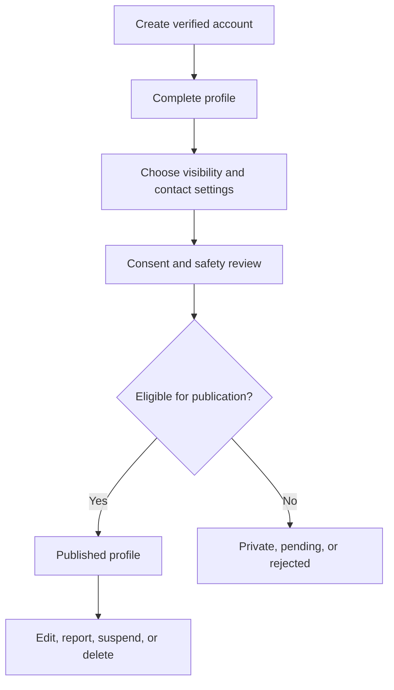

# Connect Jax

**Current status:** `DEMO ONLY`  
**Target status:** `PROPOSED`, subject to privacy and safeguarding approval

## Purpose

Allow students and young adults participating in Jacksonville experiential learning to discover peers and connect through approved external contact channels.

Connect Jax is not intended to provide direct in-platform messaging.

## Current Prototype Behavior

- Sample profiles are hard-coded in `data.js`.
- A visitor can create a profile stored only in that browser.
- The created profile is not shared with other users.
- RSVP associations are temporary.
- There is no account verification, shared database, consent record, report flow, or moderation queue.
- The profile creation/editing form displays a "Prototype note" disclosure (`LIVE`), visible before the user submits the form, stating that profiles created here are stored only in that browser and are not visible to other users.

## Proposed Public Profile Fields

| Field | Recommendation |
|---|---|
| Display name | Required |
| Employer or program | Required only after verification or user confirmation |
| Email | Required for account ownership, but private by default |
| Student level | Required |
| School | Optional and potentially restricted for minors |
| Major or grade | Optional |
| Interests | Optional |
| LinkedIn | Optional public external link |
| Other contact link | Optional and restricted to approved types |
| Profile visibility | Required selection |
| Consent timestamp | Required |
| Moderation status | Required system field |

## Contact Model

Recommended external contact options:

- LinkedIn profile
- Approved professional portfolio
- Optional email contact only for eligible adult users

The product should not publicly expose a required email address by default. A required account email and a public contact method should be treated as separate concepts.

## Profile Lifecycle

## Removal

Users must be able to:

- Hide their profile immediately
- Delete their profile
- Remove external contact links
- Revoke optional consent
- Report another profile

The operator must document whether deletion is immediate or subject to a short audit-retention period.

## Moderation

AI may flag:

- Harassment
- Sexual or exploitative content
- Hate or threats
- Spam
- Suspicious links
- Attempts to solicit minors
- Personal information placed in inappropriate fields

AI flags must route to a human review process. AI should not be the only safety control.

## Minors

Public minor profiles create substantially greater safety and governance risk.

The recommended launch sequence is:

1. Launch adult profiles first.
2. Keep high-school profiles disabled, private, or visible only in a verified closed network.
3. Add minors only after the operator approves:
   - Age verification approach
   - Guardian consent process
   - School or program verification
   - Contact restrictions
   - Reporting and escalation process
   - Human moderation coverage
   - Written privacy and safeguarding policies

Do not publicly display a minor's personal email, precise schedule, or unnecessary school/location information.
