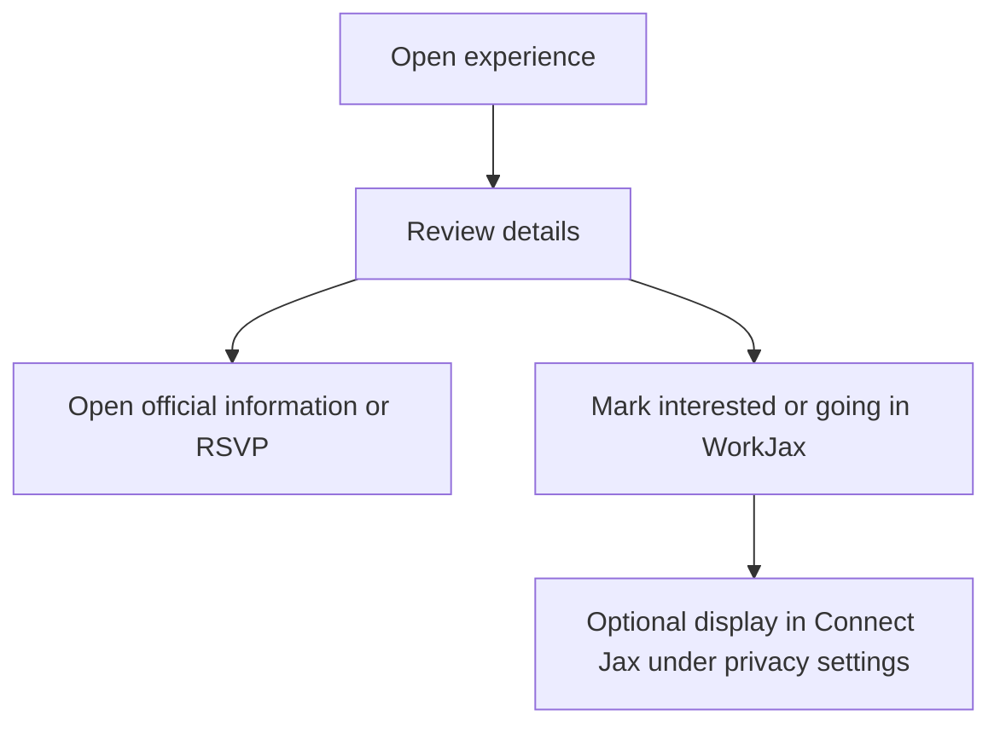

# Experience Jax

**Current status:** `LIVE` hard-coded content  
**Target status:** `PROPOSED` automatically refreshed experience directory

## Purpose

Help summer interns and year-round users discover existing Jacksonville events, recurring third spaces, and community experiences.

WorkJax generally curates existing experiences rather than creating them.

## Content Types

### Scheduled Event

A one-time or dated event with a specific start and end.

Examples:

- Concert
- Festival
- Market
- Sports game
- Community event

### Recurring Space or Experience

A repeating or ongoing gathering that may not require an RSVP.

Examples:

- Weekly market
- Recurring yoga
- Trivia night
- Community garden
- Monthly art walk

These types must remain distinct in the data model because their expiration and recurrence behavior differ.

## Required Fields

- Title
- Type
- Description
- Category or categories
- Venue
- Address
- Structured date/time or recurrence rule
- Price
- Transportation information
- Accessibility information
- Age restrictions
- Official source
- External RSVP or information URL
- Last verified date
- Status

## Target Expiration Rules

| Content | Rule |
|---|---|
| One-time event | Hide after `ends_at`, unless retained in an archive |
| Cancelled event | Hide immediately from active results |
| Recurring experience | Remain active while recurrence is valid and source continues to confirm it |
| Unverified recurring item | Move to review after the freshness threshold |
| Changed event | Update the canonical record and retain an audit entry |

## RSVP Relationship

WorkJax may allow a user to record that they plan to attend. The official ticket or organizer RSVP remains external unless a future WorkJax-hosted event is approved.

## Future WorkJax-Hosted Events

The concept of a WorkJax-hosted intern event is `TBD`. It should not be treated as an existing product capability until an operator, liability plan, event owner, and budget are identified.
