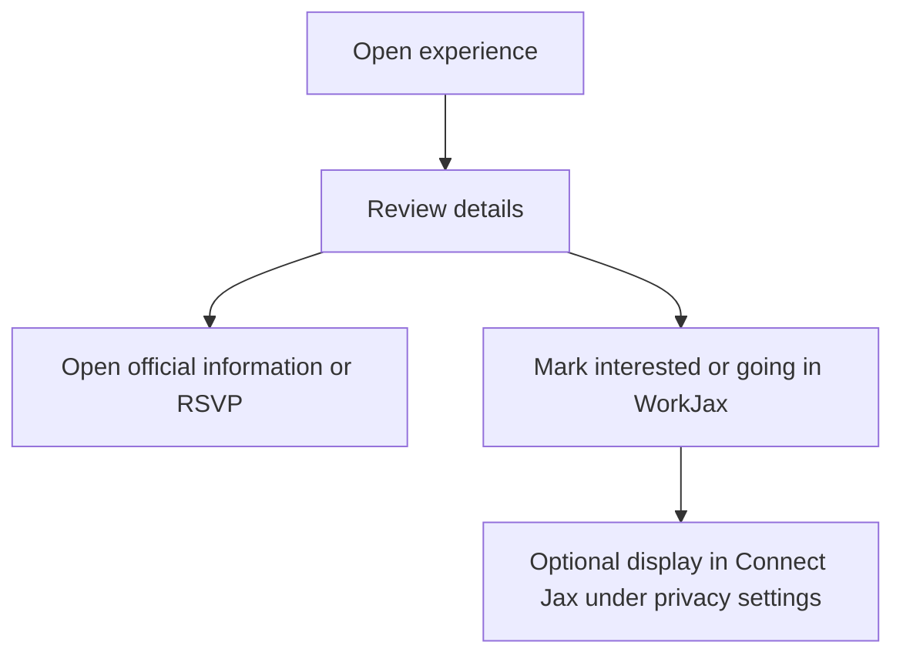

# Experience Jax

**Current status:** `LIVE` hard-coded content  
**Target status:** `PROPOSED` automatically refreshed experience directory

## Purpose

Help summer interns and year-round users discover existing Jacksonville events, recurring third spaces, and community experiences.

WorkJax generally curates existing experiences rather than creating them.

## Content Types

### Scheduled Event

A one-time or dated event with a specific start and end.

Examples:

- Concert
- Festival
- Market
- Sports game
- Community event

### Recurring Space or Experience

A repeating or ongoing gathering that may not require an RSVP.

Examples:

- Weekly market
- Recurring yoga
- Trivia night
- Community garden
- Monthly art walk

These types must remain distinct in the data model because their expiration and recurrence behavior differ.

## Required Fields

- Title
- Type
- Description
- Category or categories
- Venue
- Address
- Structured date/time or recurrence rule
- Price
- Transportation information
- Accessibility information
- Age restrictions
- Official source
- External RSVP or information URL
- Last verified date
- Status

## Target Expiration Rules

| Content | Rule |
|---|---|
| One-time event | Hide after `ends_at`, unless retained in an archive |
| Cancelled event | Hide immediately from active results |
| Recurring experience | Remain active while recurrence is valid and source continues to confirm it |
| Unverified recurring item | Move to review after the freshness threshold |
| Changed event | Update the canonical record and retain an audit entry |

## RSVP Relationship

WorkJax may allow a user to record that they plan to attend. The official ticket or organizer RSVP remains external unless a future WorkJax-hosted event is approved.

**Disclosure (`LIVE`):** Every event card displays a "Prototype note" directly above the RSVP control, visible before the user selects RSVP, stating that the RSVP is for demonstration only, does not register the user with the event organizer, and that the official event link should be used to register.

## Future WorkJax-Hosted Events

The concept of a WorkJax-hosted intern event is `TBD`. It should not be treated as an existing product capability until an operator, liability plan, event owner, and budget are identified.

## Structured Date Fields (`LIVE`, values currently `null`/unverified)

Per `docs/data/date-normalization-audit.md`, every `events` record in `data.js` now carries:

- `experienceType` — `"scheduled_event"` or `"recurring_space"` where the audit clearly recommends one of those two values; `null` where the audit instead flags the record as needing a future split (e.g. Cody Johnson Live '26, Jax River Jams, Jumbo Shrimp Baseball) or as a standing/evergreen activity that doesn't fit the current two-value enum (e.g. Kayaking, Jacksonville Beach, Timucuan Preserve)
- `startsAt`, `endsAt`, `recurrenceRule` — `null` on every current record, including Cody Johnson Live '26 and The Music of David Bowie (Symphonic), whose source verification is still incomplete
- `dateVerificationStatus` — `"unverified"` on every current record

`isEventActive(record)` in `app.js` gates the Experience Jax grid: it only excludes a record when `dateVerificationStatus === "verified"` **and** `endsAt` is a past date. Since every current record is unverified, the helper returns `true` for all 15 records today and nothing is hidden. The original `date` text field remains the display source of truth; no event record was split as part of adding these fields.

## Third Spaces Page Layout: Community Event Platform + Explore Jacksonville

**Current status:** `LIVE` single continuous page; `DEMO ONLY` Community Event Platform content shown first on it

As of 2026-07-14, the Third Spaces page is one continuous page (the previous nested-tab interface has been removed) in this order:

1. The existing Third Spaces page introduction (unchanged).
2. **Community Event Platform** — a separate, `DEMO ONLY` prototype adapted from a different public project (`espil77/3rd-Space`), now shown first. It uses its own isolated data (`community-event-data.js`) and its own script (`community-event-platform.js`); it does not read or write the `events` array, `renderEvents()`, or the RSVP data described above. It includes an accessible Morning/Afternoon/Evening theme-preview control (see [Community Event Platform](community-event-platform.md) §8) in addition to its existing automatic local-time theming.
3. A visual divider.
4. **Explore Jacksonville** — everything described above in this document (recurring Third Spaces cards, "ideas we're exploring" chips, scheduled-events filters/grid/RSVP), now under its own "Explore Jacksonville" heading and introduction, directly beneath Community Event Platform on the same page. This content's markup, data, and behavior are unchanged from before the restructuring — only its wrapping tab panel was removed.

These two sections must not be conflated in future documentation or code: this page's event-discovery content (item 4) is WorkJax's own curated data; the Community Event Platform section (item 2) is an adapted external concept; and a possible future SMS-based version of that concept remains `PROPOSED` and unbuilt. See [Community Event Platform](community-event-platform.md) for full detail on the theme-preview control and the removal of the nested-tab interface. This was a material interface change; accessibility status for the page remains `NOT ASSESSED`.
