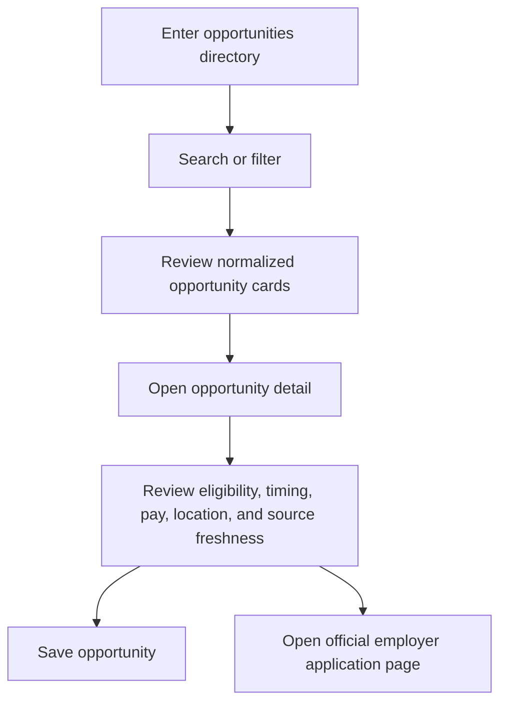

# Find Opportunities

**Current status:** `LIVE` static listing and filtering  
**Target status:** `PROPOSED` automatically refreshed directory

## Purpose

Help high school and college students discover relevant experiential learning opportunities across Northeast Florida and continue to the employer's official application page.

## Product Rules

- Applications happen outside WorkJax.
- One opportunity may support both high school and college students.
- One opportunity may belong to multiple industries.
- Opportunities may be summer, semester-based, or year-round.
- Expired or closed opportunities should leave active search results automatically.
- Users should be able to save opportunities.
- Employers should have pages showing all current opportunities.
- WorkJax should avoid requiring employers to duplicate existing listings.

## Current Components

| Component | Current State |
|---|---|
| Search | Searches employer name, industry, and program names |
| Student-level filter | High school, college, or both |
| Type filter | Internship, job shadow, co-op, fellowship, volunteer, apprenticeship |
| Industry filter | Eight current categories |
| Compensation filter | Paid or unpaid/credit |
| Sort | Featured, deadline, alphabetical. Featured sort uses each record's `isFeatured` boolean (`LIVE`): featured records are placed first, and original array order is preserved within both the featured and non-featured groups. |
| Opportunity cards | Built from employer records |
| Detail page | Shows description, requirements, program details, location, and application link. Reached via `navigateToEmployer(id)` (`app.js`), which pushes a `?view=detail&employer=<id>` browser-history entry so Back/Forward and direct reloads work — see `docs/features/browser-navigation.md`. |
| Save | Stored only in browser `localStorage`. A "Prototype note" disclosure is shown above the results list on the Opportunities board (`LIVE`), visible before any opportunity is saved, stating that saved opportunities are stored only in that browser on that device. |
| Active-record filtering | `LIVE`. `isOpportunityActive(record)` in `app.js` gates homepage featured opportunities and opportunity search results. It only excludes a record when `dateVerificationStatus === "verified"` **and** `applicationCloseAt` is a past date. Every current record has `dateVerificationStatus: "unverified"` (see `docs/data/date-normalization-audit.md`), so the helper currently returns `true` for all 38 records and nothing is hidden. |
| Employer live-opportunity feed | `LIVE`, registry-driven, scoped to employers with an enabled entry in `live-opportunity-sources.js`. Currently the Dun & Bradstreet detail page (`data.js` `id: 41`) fetches `GET /api/dnb-lever-jobs`, and the Miller Electric Company detail page (`data.js` `id: 13`) fetches `GET /api/miller-internship-program` — each only when its own detail page is opened. See "Live Employer Opportunity Feed" below and `docs/integrations/employer-feed-registry.md`. |
| Browser Back/Forward | `LIVE`, added 2026-07-14. Opening a detail page (from a card, search suggestion, or map) pushes one browser-history entry; Back returns to the originating page with its search, filters, sort, and (where practical) scroll position intact, without calling `clearAllFilters()`. Forward reopens the same employer. See `docs/features/browser-navigation.md`. |

## Structured Date Fields (`LIVE`, values currently `null`/unverified)

Every `employers` record in `data.js` now carries:

- `applicationTiming` — the audit's classification (`annual_recurring`, `fixed_dated`, `seasonal_window`, `rolling`, or `unknown`)
- `applicationOpenAt` / `applicationCloseAt` — `null` on every current record; no year or date was invented
- `dateVerificationStatus` — `"unverified"` on every current record

These fields exist so a future, separately-approved verification pass can populate real timestamps and flip `dateVerificationStatus` to `"verified"` without a schema change. The `deadline` text field remains the display source of truth and the existing deadline sort (`deadlineSortKey()`) is unchanged.

## Live Employer Opportunity Feed

**Status:** `LIVE`, registry-driven, scoped to whichever employer(s) have an enabled entry in the employer-feed registry. Currently two entries are enabled: Dun & Bradstreet and Miller Electric Company.
**Files:** `live-opportunity-sources.js` (the registry), `app.js` (`getLiveOpportunitySource()`, `fetchLiveOpportunities()`, `renderLiveOpportunitySection()`, and the `liveOpportunity*HTML` rendering functions, including the generic `postingKind: "official_program"` handling), `styles.css` (`.live-opp-*` classes), `api/dnb-lever-jobs.js` (unchanged), `api/miller-internship-program.js`, `docs/integrations/employer-feed-registry.md`, `docs/integrations/dnb-lever-poc.md`, `docs/integrations/miller-internship-program.md`.

Opening an employer's detail page (`showDetail(id)` in `app.js`) checks `live-opportunity-sources.js` for a matching, enabled registry entry by the employer's stable `id`. Two curated employer detail pages currently match:

- **Dun & Bradstreet** (`data.js` `id: 41`, unchanged): includes an additional section, **"Current opportunities from Dun & Bradstreet,"** sourced live from `GET /api/dnb-lever-jobs`.
- **Miller Electric Company** (`data.js` `id: 13`, unchanged): includes an additional section, **"Miller Electric Internship Program"** (the registry entry's `sectionTitle`), sourced live from `GET /api/miller-internship-program`. Unlike Dun & Bradstreet's structured Lever job feed, Miller has no public jobs API this project integrates with — the endpoint instead reads Miller's own official internship-program webpage (`mecojax.com`) and returns one normalized *program*-level record, never individual job listings. See `docs/integrations/miller-internship-program.md` for the full parsing, status-detection, and limitation details.

- The matching employer's endpoint is called only when that employer's detail page is opened — never on initial page load, never for any employer without a matching enabled registry entry, and there is no new employer card anywhere in the directory, search, home page, or map.
- The live-feed container's DOM ID is generic — `live-opportunities-<employerId>` (e.g. `live-opportunities-41` for Dun & Bradstreet, `live-opportunities-13` for Miller) — rather than employer-specific markup.
- Each result is tagged `postingKind`, and the frontend rendering is entirely generic (no employer-specific rendering functions exist for any `postingKind`):
  - `open_opportunity` — a current opportunity with an "Apply Officially" link.
  - `talent_network` — (for Dun & Bradstreet, its Early Talent Network) shown in a visually separate, clearly labeled "Talent Network" group with explicit text that it is a recruitment-interest signup, **not** a currently open job, and a "Join Talent Network" link instead.
  - `official_program` — (currently only Miller Electric) shown as a single program card with: the source badge, program title, an explicit application-status line (**"Applications open,"** **"Applications closed,"** or **"Status not currently confirmed"** — driven by the endpoint's own `programStatus` field, never inferred from the presence of a link), opportunity type, student level and paid status (only when the source explicitly supplied them), location, last verified date, an accessible native `

Explore internship areas

` section listing `programAreas` as pills (omitted entirely when the source returned none), and one action button. The action button reads **"Apply on Official Site"** only when `programStatus === "open"` and an approved `applicationUrl` exists; otherwise it reads **"View Official Program"** — it is never labeled "Apply Officially"/"Apply on Official Site" for a closed or unknown program.
- Every card shows a badge using the registry entry's `sourceLabel` (`"Live from employer"` for D&B, `"Verified on employer site"` for Miller) and only the fields actually present in the response.
- **Loading:** a short "Checking for current opportunities…" message appears immediately when the detail page opens, for both sources.
- **Empty (`count: 0`):** a message states no current matching opportunities were found; the curated "Apply Directly at [employer]" careers link in the sidebar remains visible regardless.
- **Error** (network failure, timeout, non-200): a small "temporarily unavailable" message replaces only this section — the curated hero, requirements, programs, and sidebar content (all unchanged) continue to render normally. For Miller specifically, an endpoint failure is never displayed as the program being closed, and an `"unknown"` program status is never displayed as open.
- **Caching:** a successful response is cached in memory (keyed by endpoint) for the rest of the browser page session (WorkJax is a single-page app; "session" means until the tab is reloaded), so reopening the same employer's detail page does not re-call the endpoint. A failed request is not cached, so the next time the page is opened, it retries. Concurrent requests to the same endpoint are deduplicated via a second in-memory Map.
- WorkJax never processes the application — every link opens the employer's own official site (or, for Miller, its approved EMCOR careers destination) in a new tab.
- No employer without a matching, enabled registry entry is affected. No database, framework, package, login, scheduled job, or new API key was added. Adding a future employer source requires its own endpoint, validation, documentation, and testing — see `docs/integrations/employer-feed-registry.md`.

## Target User Flow

## Target Business Rules

1. Each opportunity is a separate record.
2. Each opportunity links to exactly one official employer.
3. A listing is active only when:
   - Its source is approved
   - Its official application URL is reachable or verified
   - It is not past a known closing date
   - It has not disappeared from a structured source beyond the defined grace period
4. Records with conflicting information enter `review_required`.
5. Rolling opportunities remain active but must still be rechecked.
6. Featured opportunities require an explicit flag, end date, and selection owner.
7. The listing displays `last verified` information.
8. Duplicate listings from multiple sources merge into one canonical record.

## Required Public Fields

- Opportunity title
- Employer
- Opportunity type
- Student level
- Industry or industries
- Seasonality
- Work mode
- Location or remote status
- Compensation status
- Description
- Requirements
- Application URL
- Deadline or rolling status
- Source
- Last verified date

## Featured Opportunities

**Current status:** `LIVE`. Featured status is stored as an explicit `isFeatured` boolean on each record in the `employers` array in `data.js`, not derived from array position. The homepage (`renderHomeFeatured()`) shows up to six records with `isFeatured === true`. The opportunities page "Featured" sort places `isFeatured === true` records first, preserving original array order within the featured group and within the non-featured group.

There is still no formal selection rule, review date, or owner for which records are marked `isFeatured: true` — that curation remains manual. The richer criteria and controls below remain `PROPOSED`.

### Proposed criteria

A featured opportunity may be selected because it is:

- Newly opened
- Time-sensitive
- Paid
- Available to high school students
- Offered by a major regional employer
- Unusual or especially high-impact
- Underrepresented in the current industry mix

### Required controls

- `is_featured` — `LIVE` today as the `isFeatured` boolean field on `employers` records in `data.js`.
- `featured_reason` — `PROPOSED`
- `featured_until` — `PROPOSED`
- `featured_by` — `PROPOSED`
- Approval owner: `TBD`

## Success Metrics

- Opportunity-detail views
- Official application-link clicks
- Saves
- Search-to-detail conversion
- Percentage of listings verified within the freshness standard
- Percentage of listings removed within one day of confirmed closure
- Industry and student-level coverage
