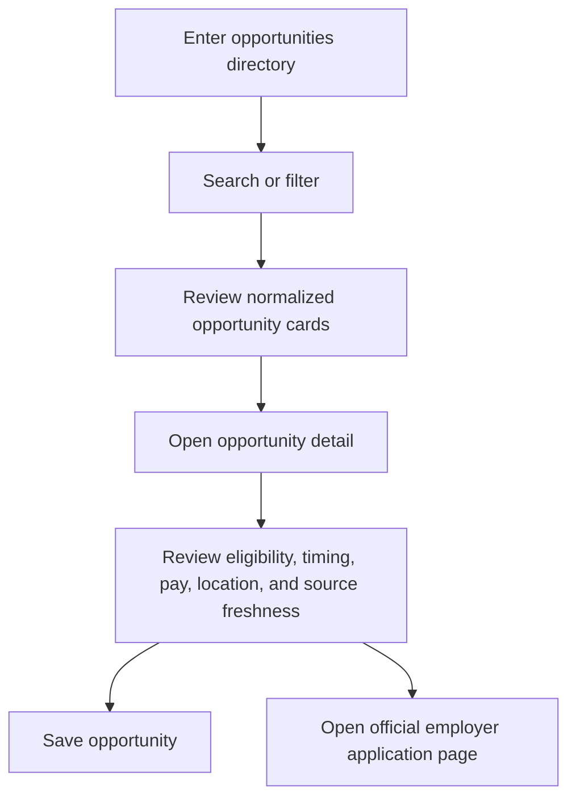

# Find Opportunities

**Current status:** `LIVE` static listing and filtering  
**Target status:** `PROPOSED` automatically refreshed directory

## Purpose

Help high school and college students discover relevant experiential learning opportunities across Northeast Florida and continue to the employer's official application page.

## Product Rules

- Applications happen outside WorkJax.
- One opportunity may support both high school and college students.
- One opportunity may belong to multiple industries.
- Opportunities may be summer, semester-based, or year-round.
- Expired or closed opportunities should leave active search results automatically.
- Users should be able to save opportunities.
- Employers should have pages showing all current opportunities.
- WorkJax should avoid requiring employers to duplicate existing listings.

## Current Components

| Component | Current State |
|---|---|
| Search | Searches employer name, industry, and program names |
| Student-level filter | High school, college, or both |
| Type filter | Internship, job shadow, co-op, fellowship, volunteer, apprenticeship |
| Industry filter | Eight current categories |
| Compensation filter | Paid or unpaid/credit |
| Sort | Featured, deadline, alphabetical. Featured sort uses each record's `isFeatured` boolean (`LIVE`): featured records are placed first, and original array order is preserved within both the featured and non-featured groups. |
| Opportunity cards | Built from employer records |
| Detail page | Shows description, requirements, program details, location, and application link |
| Save | Stored only in browser `localStorage`. A "Prototype note" disclosure is shown above the results list on the Opportunities board (`LIVE`), visible before any opportunity is saved, stating that saved opportunities are stored only in that browser on that device. |
| Active-record filtering | `LIVE`. `isOpportunityActive(record)` in `app.js` gates homepage featured opportunities and opportunity search results. It only excludes a record when `dateVerificationStatus === "verified"` **and** `applicationCloseAt` is a past date. Every current record has `dateVerificationStatus: "unverified"` (see `docs/data/date-normalization-audit.md`), so the helper currently returns `true` for all 38 records and nothing is hidden. |
| Dun & Bradstreet live Lever section | `LIVE`, scoped to a single employer. The existing Dun & Bradstreet detail page (`data.js` `id: 41`) fetches `GET /api/dnb-lever-jobs` only when that detail page is opened, and only that page. See "Dun & Bradstreet Live Opportunities Section" below. |

## Structured Date Fields (`LIVE`, values currently `null`/unverified)

Every `employers` record in `data.js` now carries:

- `applicationTiming` — the audit's classification (`annual_recurring`, `fixed_dated`, `seasonal_window`, `rolling`, or `unknown`)
- `applicationOpenAt` / `applicationCloseAt` — `null` on every current record; no year or date was invented
- `dateVerificationStatus` — `"unverified"` on every current record

These fields exist so a future, separately-approved verification pass can populate real timestamps and flip `dateVerificationStatus` to `"verified"` without a schema change. The `deadline` text field remains the display source of truth and the existing deadline sort (`deadlineSortKey()`) is unchanged.

## Dun & Bradstreet Live Opportunities Section

**Status:** `LIVE`, scoped to exactly one employer's detail page.
**Files:** `app.js` (`dnbLever*` functions, `fetchDnbLeverJobs()`, `loadDnbLeverJobsSection()`), `styles.css` (`.dnb-live-*` classes), `api/dnb-lever-jobs.js` (unchanged), `docs/integrations/dnb-lever-poc.md`.

The existing, curated Dun & Bradstreet employer detail page (`data.js` `id: 41`, unchanged) now includes an additional section, **"Current opportunities from Dun & Bradstreet,"** sourced live from `GET /api/dnb-lever-jobs`.

- The endpoint is called only when this specific detail page is opened — never on initial page load, never for any other employer, and there is no new employer card anywhere in the directory, search, home page, or map.
- Each result is tagged `postingKind`: an `open_opportunity` is shown as a current opportunity with an "Apply Officially" link; a `talent_network` posting (Dun & Bradstreet's Early Talent Network) is shown in a visually separate, clearly labeled "Talent Network" group with explicit text that it is a recruitment-interest signup, **not** a currently open job, and a "Join Talent Network" link instead.
- Every card shows a "Live from employer" badge and only the fields actually present in the response: title, opportunity type, location, workplace type, commitment, salary (only when Lever provides `salaryRange`), last verified date, and the official external `applicationUrl`.
- **Loading:** a short "Checking for current opportunities…" message appears immediately when the detail page opens.
- **Empty (`count: 0`):** a message states no current matching opportunities were found; the curated "Apply Directly at Dun & Bradstreet" careers link in the sidebar remains visible regardless.
- **Error** (network failure, timeout, non-200): a small "temporarily unavailable" message replaces only this section — the curated hero, requirements, programs, and sidebar content (all unchanged) continue to render normally.
- **Caching:** a successful response is cached in memory for the rest of the browser page session (WorkJax is a single-page app; "session" means until the tab is reloaded), so reopening the Dun & Bradstreet detail page does not re-call the endpoint. A failed request is not cached, so the next time the page is opened, it retries.
- WorkJax never processes the application — every link opens Dun & Bradstreet's own official site in a new tab.
- No other employer's detail page is affected. No database, framework, package, login, scheduled job, or new API key was added.

## Target User Flow

## Target Business Rules

1. Each opportunity is a separate record.
2. Each opportunity links to exactly one official employer.
3. A listing is active only when:
   - Its source is approved
   - Its official application URL is reachable or verified
   - It is not past a known closing date
   - It has not disappeared from a structured source beyond the defined grace period
4. Records with conflicting information enter `review_required`.
5. Rolling opportunities remain active but must still be rechecked.
6. Featured opportunities require an explicit flag, end date, and selection owner.
7. The listing displays `last verified` information.
8. Duplicate listings from multiple sources merge into one canonical record.

## Required Public Fields

- Opportunity title
- Employer
- Opportunity type
- Student level
- Industry or industries
- Seasonality
- Work mode
- Location or remote status
- Compensation status
- Description
- Requirements
- Application URL
- Deadline or rolling status
- Source
- Last verified date

## Featured Opportunities

**Current status:** `LIVE`. Featured status is stored as an explicit `isFeatured` boolean on each record in the `employers` array in `data.js`, not derived from array position. The homepage (`renderHomeFeatured()`) shows up to six records with `isFeatured === true`. The opportunities page "Featured" sort places `isFeatured === true` records first, preserving original array order within the featured group and within the non-featured group.

There is still no formal selection rule, review date, or owner for which records are marked `isFeatured: true` — that curation remains manual. The richer criteria and controls below remain `PROPOSED`.

### Proposed criteria

A featured opportunity may be selected because it is:

- Newly opened
- Time-sensitive
- Paid
- Available to high school students
- Offered by a major regional employer
- Unusual or especially high-impact
- Underrepresented in the current industry mix

### Required controls

- `is_featured` — `LIVE` today as the `isFeatured` boolean field on `employers` records in `data.js`.
- `featured_reason` — `PROPOSED`
- `featured_until` — `PROPOSED`
- `featured_by` — `PROPOSED`
- Approval owner: `TBD`

## Success Metrics

- Opportunity-detail views
- Official application-link clicks
- Saves
- Search-to-detail conversion
- Percentage of listings verified within the freshness standard
- Percentage of listings removed within one day of confirmed closure
- Industry and student-level coverage
