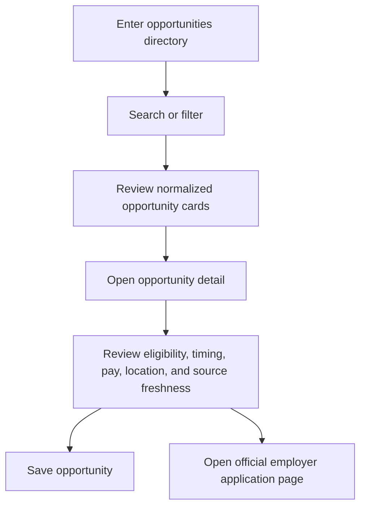

# Find Opportunities

**Current status:** `LIVE` static listing and filtering  
**Target status:** `PROPOSED` automatically refreshed directory

## Purpose

Help high school and college students discover relevant experiential learning opportunities across Northeast Florida and continue to the employer's official application page.

## Product Rules

- Applications happen outside WorkJax.
- One opportunity may support both high school and college students.
- One opportunity may belong to multiple industries.
- Opportunities may be summer, semester-based, or year-round.
- Expired or closed opportunities should leave active search results automatically.
- Users should be able to save opportunities.
- Employers should have pages showing all current opportunities.
- WorkJax should avoid requiring employers to duplicate existing listings.

## Current Components

| Component | Current State |
|---|---|
| Search | Searches employer name, industry, and program names |
| Student-level filter | High school, college, or both |
| Type filter | Internship, job shadow, co-op, fellowship, volunteer, apprenticeship |
| Industry filter | Eight current categories |
| Compensation filter | Paid or unpaid/credit |
| Sort | Featured, deadline, alphabetical |
| Opportunity cards | Built from employer records |
| Detail page | Shows description, requirements, program details, location, and application link |
| Save | Stored only in browser `localStorage` |

## Target User Flow

## Target Business Rules

1. Each opportunity is a separate record.
2. Each opportunity links to exactly one official employer.
3. A listing is active only when:
   - Its source is approved
   - Its official application URL is reachable or verified
   - It is not past a known closing date
   - It has not disappeared from a structured source beyond the defined grace period
4. Records with conflicting information enter `review_required`.
5. Rolling opportunities remain active but must still be rechecked.
6. Featured opportunities require an explicit flag, end date, and selection owner.
7. The listing displays `last verified` information.
8. Duplicate listings from multiple sources merge into one canonical record.

## Required Public Fields

- Opportunity title
- Employer
- Opportunity type
- Student level
- Industry or industries
- Seasonality
- Work mode
- Location or remote status
- Compensation status
- Description
- Requirements
- Application URL
- Deadline or rolling status
- Source
- Last verified date

## Featured Opportunities

Current behavior is positional and should be replaced.

### Proposed criteria

A featured opportunity may be selected because it is:

- Newly opened
- Time-sensitive
- Paid
- Available to high school students
- Offered by a major regional employer
- Unusual or especially high-impact
- Underrepresented in the current industry mix

### Required controls

- `is_featured`
- `featured_reason`
- `featured_until`
- `featured_by`
- Approval owner: `TBD`

## Success Metrics

- Opportunity-detail views
- Official application-link clicks
- Saves
- Search-to-detail conversion
- Percentage of listings verified within the freshness standard
- Percentage of listings removed within one day of confirmed closure
- Industry and student-level coverage
