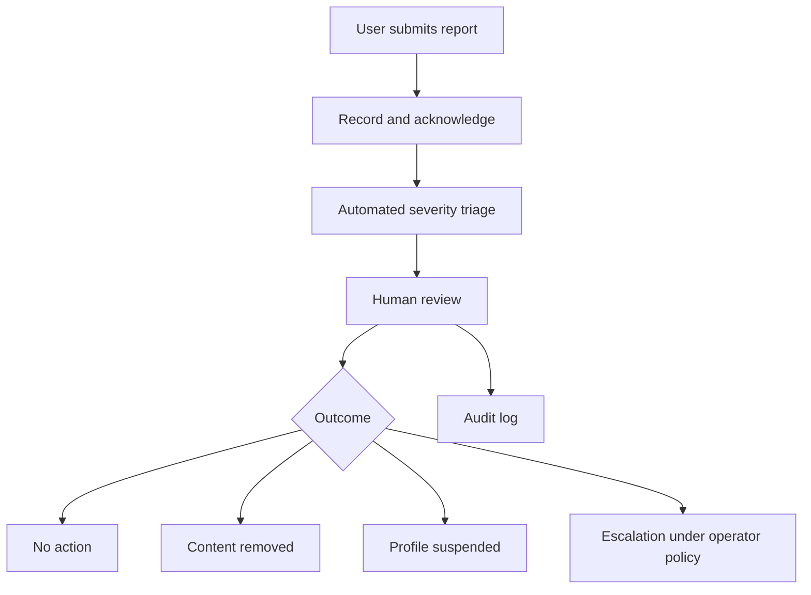

# Privacy and Safety

**Status:** `PROPOSED`  
**Required before:** Public launch of shared profiles or RSVPs

## Principles

1. Collect only information needed for a defined product purpose.
2. Separate private account data from public profile data.
3. Make profile visibility opt-in.
4. Make deletion and hiding easy.
5. Give minors stronger default protections.
6. Do not use AI as the only moderation or safety mechanism.
7. Publish clear reporting and escalation processes.
8. Assign a named privacy and safety owner.

## Data Classification

| Classification | Examples | Default Handling |
|---|---|---|
| Public product data | Employer name, official job link, event venue | Public |
| Public profile data | Display name, approved interests, optional LinkedIn | Opt-in |
| Private account data | Email, authentication details, consent records | Private |
| Sensitive operational data | Moderation notes, reports, guardian consent | Strictly restricted |
| Prohibited public data | Passwords, precise live location, private contact details for minors | Never public |

## Consent Requirements

A profile-creation flow should clearly explain:

- What information will be public
- Who can view it
- How external contact links work
- How the user can hide or delete the profile
- Whether RSVP activity may appear
- How reports and moderation work
- Whether data is used for analytics

Consent must be affirmative and recorded with a timestamp and policy version.

## Recommended Profile Defaults

| User Type | Default Visibility | Public Email |
|---|---|---|
| Adult | Private until user opts in | No |
| Minor | Private or unavailable | Never |
| Sample/demo profile | Clearly labeled fictional | No real contact details |

## Minor Safeguarding Recommendation

Before any minor profile is visible, the operator should obtain qualified legal and safeguarding review.

At minimum, the product should consider:

- Guardian consent
- Verified affiliation with a school, employer, or program
- Closed-directory access
- No direct public email
- Restricted external links
- No precise schedules or live attendance visibility
- Easy reporting
- Human moderation and escalation
- Record-retention limits
- Emergency procedures for credible threats or exploitation

## Reporting Workflow

## Required Governance Owners

- Privacy owner: `TBD`
- Safeguarding owner: `TBD`
- Moderation lead: `TBD`
- Incident escalation contact: `TBD`
- Data deletion contact: `TBD`
