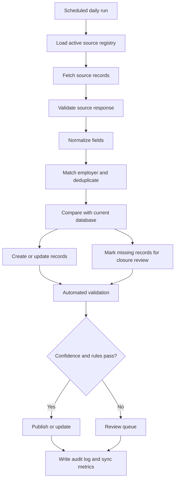

# Content Ingestion and Freshness

**Status:** `PROPOSED`

**A narrower, real exception exists today (`LIVE`):** `docs/operations/employer-feed-monitoring.md` describes a GitHub Actions workflow that weekly rechecks a small, fixed set of public Lever, Greenhouse, and iCIMS-public-portal sources (Dun & Bradstreet, Fanatics, and — as of this task — Miller Electric Company's public EMCOR iCIMS job search) and maintains a single GitHub issue reporting qualifying Jacksonville student/early-talent postings. It is not the daily, database-backed ingestion pipeline described below — it does not write to `data.js`, does not publish to the WorkJax UI, and covers only three ATS providers. Miller Electric's entry reads only a public, unauthenticated iCIMS career-portal HTML page — never the authenticated iCIMS customer/integration API (`api.icims.com`) — and public iCIMS HTML is inherently less stable than Lever's or Greenhouse's structured JSON; a parser failure or blocked page is always reported as a source-health warning, never interpreted as zero jobs. It is a monitoring aid for human review, not an implementation of this document's target-state pipeline.

**A second, narrower exception also exists today (`LIVE`):** `docs/operations/monthly-ats-discovery.md` describes a GitHub Actions workflow that monthly rechecks all 38 current `data.js` employers' official careers pages for evidence of which ATS platform (if any) they use — a broken/redirected URL, a new Lever or Greenhouse link, or a platform change. It reports only *observed evidence* in a single GitHub issue; it does not fetch any structured postings feed, does not write to `data.js`, and does not add or modify any entry in `monitoring/employer-feed-watch.json` or `live-opportunity-sources.js`. Like the weekly monitor, it is a research aid for human review, not an implementation of this document's target-state pipeline.

## Objective

Keep opportunities and experiences current without requiring employers and organizers to re-enter information already published elsewhere.

There is unlikely to be one universal API covering every WorkJax source. The recommended model is a source registry with multiple approved ingestion methods.

## Source Priority

Use the highest reliable method available for each source:

1. Official public API or job-board feed
2. Official RSS, JSON, XML, or calendar feed
3. Structured data embedded in the official webpage
4. Approved partner export
5. Controlled webpage extraction
6. Manual entry as a fallback

## Daily Opportunity Pipeline

## Source Registry Requirements

Every source must define:

- Organization
- Source URL
- Source type
- Expected fields
- Sync frequency
- Parsing or adapter method
- Owner
- Last successful sync
- Last record count
- Last error
- Active/inactive status

## Opportunity Validation

Automated checks should include:

- Official source domain
- Reachable application URL
- Employer match
- Jacksonville or Northeast Florida relevance
- Allowed opportunity type
- Student-level eligibility
- Structured or inferred deadline
- Duplicate detection
- Prohibited or suspicious content
- Material change detection

## Expiration Logic

### Known closing date

Set the opportunity to `expired` immediately after `application_close_at`.

### Source marks listing closed

Set to `closed` on the next successful sync.

### Listing disappears from source

Do not delete immediately. Mark it as `missing_from_source`, then:

- Recheck during the next sync
- Close after a defined grace period
- Route high-value or ambiguous listings to review

### Rolling listing

Keep active only while the source continues to confirm the listing and the freshness standard is met.

## Event Ingestion

Scheduled events require structured `starts_at` and `ends_at` values. Recurring experiences require a recurrence rule or defined schedule.

The event pipeline should:

- Detect cancellations and venue changes
- Expire dated events automatically
- Reconfirm recurring experiences
- Preserve the official source URL
- Avoid copying ticketing or organizer data beyond what is needed

## Human Review Is Still Required

Automation should reduce repetitive work, not eliminate accountability.

A human reviewer is needed for:

- Conflicting deadlines
- Unclear student eligibility
- Sources that change layout
- Duplicate employers
- Suspicious or inappropriate content
- Incorrect geocoding
- Cancelled events not reflected consistently
- Featured-content decisions

## Monitoring

Track:

- Sources checked
- Successful and failed sources
- Records added
- Records updated
- Records closed
- Records sent to review
- Average age since last verification
- Broken outbound links
