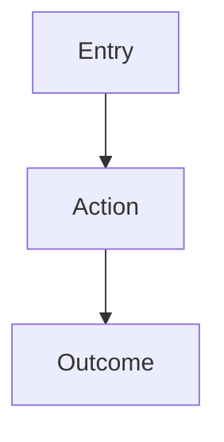

# [Feature Name]

- **Current status:** `LIVE` / `DEMO ONLY` / `PROPOSED` / `TBD`
- **Product owner:** TBD
- **Technical owner:** TBD
- **Content owner:** TBD
- **Last reviewed:** YYYY-MM-DD
- **Related code:** `path/to/file`
- **Related data:** [Data model link]

## Purpose

Why does this feature exist?

## Primary Users

- Primary:
- Secondary:
- Administrative:

## User Need

> As a [user], I need to [action] so that [outcome].

## Current Behavior

Describe only what the deployed product actually does.

## Target Behavior

Describe approved or proposed future behavior and label it clearly.

## Entry Points

How does a user reach the feature?

## User Flow

## Components

| Component | Purpose | Input | Output | Reused Elsewhere |
|---|---|---|---|---|
| Example | | | | |

## Data Dependencies

| Data | Source | Required Fields | Update Frequency | Owner |
|---|---|---|---|---|
| Example | | | | |

## Business Rules

1.
2.
3.

## Empty, Loading, and Error States

### Empty

### Loading

### Error

## Privacy and Safety

- Personal information:
- Public information:
- Minor considerations:
- Moderation:
- Accessibility:

## Metrics

- Metric:
- Definition:
- Target:
- Collection method:

## Known Limitations

-

## Open Questions

-

## Change Log

| Date | Change | Author |
|---|---|---|
| YYYY-MM-DD | Initial documentation | |
